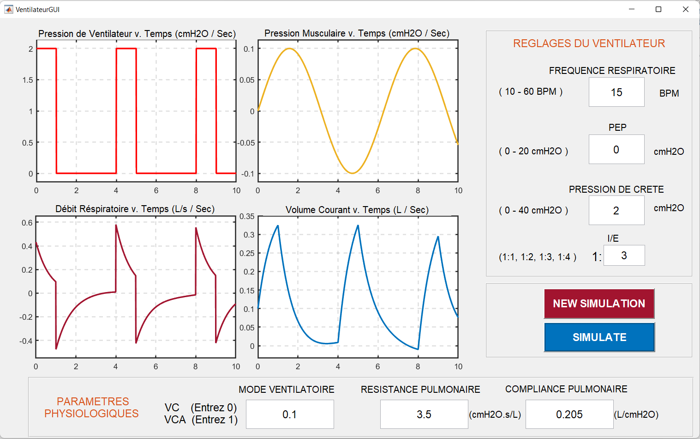

<h1 align="center">🚀 Ventilator Simulation</h1>

A Simulink model and Matlab GUI for simulating the behavior of a ventilator.

  
  
  

  

# 🚀 Ventilator Simulation

A Simulink model and Matlab GUI for simulating the behavior of a ventilator.

## 📦 Contents

- `VentilateurMODELE.slx`: Simulink model of the ventilator simulation
- `VentilateurGUI.m`: Matlab script for the GUI interface
- `VentilateurGUI.fig`: Matlab figure file for the GUI interface

## 🧰 Dependencies

- Matlab with Simulink toolbox

## 🚀 Usage

1. Open the `VentilateurGUI.m` file in Matlab.
2. Click the "Run" button to launch the GUI.
3. Use the buttons and input fields in the GUI to control the ventilator simulation.

## Show your support

Give a ⭐️ if this project helped you!
